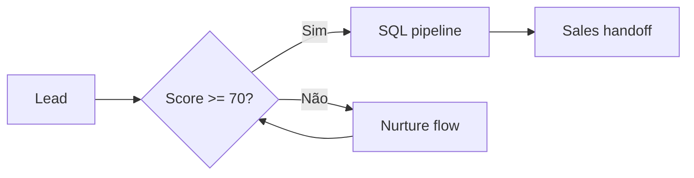
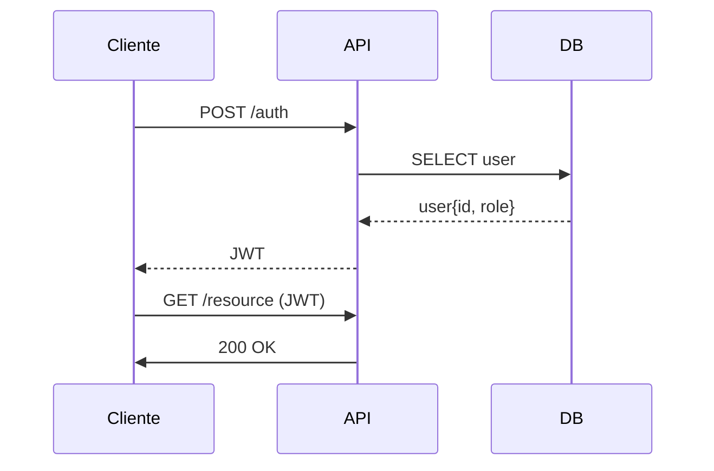
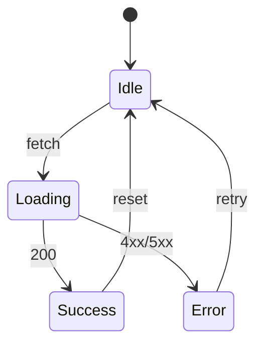
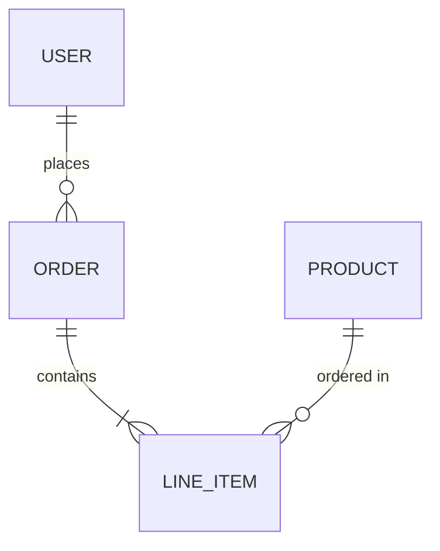
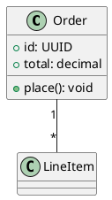

# Diagrams & Math — Reference

3 sistemas: **Mermaid** (flowchart, sequence, ER, state, gantt — semântico, mais usado), **PlantUML/Kroki** (UML formal, BPMN, ArchiMate), **LaTeX/KaTeX** (fórmulas matemáticas + química via mhchem).

---

## Mermaid — preferido para diagramas padrão

Renderização nativa do Slidev, sintaxe declarativa, mantém o tema do deck.

### Flowchart

````md

````

### Sequence diagram

````md

````

### State machine

````md

````

### ER diagram

````md

````

### Configuração inline

````md

````

Opções: `theme` (`default`, `dark`, `forest`, `neutral`), `scale` (multiplicador), `securityLevel`.

### Configuração global (headmatter)

```yaml
mermaid:
  theme: neutral
  themeVariables:
    primaryColor: '#5eead4'
    primaryTextColor: '#0b1020'
```

---

## PlantUML / Kroki — UML formal

Use quando o diagrama precisa ser UML compliant (use case, class, deployment, ArchiMate, BPMN). Renderiza via Kroki online.

````md

````

Mais raro num deck cinematográfico — só use se a audiência (banca, comitê de arquitetura) **espera** UML formal. Caso contrário, Mermaid é mais limpo.

---

## LaTeX / KaTeX — fórmulas matemáticas

### Inline

```md
A velocidade orbital é $v = \sqrt{\mu/r}$ para órbita circular.
```

### Block

```md
$$
\Delta v = v_e \cdot \ln\!\left(\frac{m_0}{m_f}\right)
$$
```

### Staged highlighting

```md
$$ {1|3|all}
\begin{aligned}
a &= b + c \\
&= 2c + d \\
&= 3d
\end{aligned}
$$
```

Cada `|` consome 1 click — primeiro destaca linha 1, depois 3, depois tudo.

### Mhchem (química)

Habilitar no `vite.config.ts` (template já vem com isso quando relevante):

```ts
import 'katex/contrib/mhchem'
```

Uso:

```md
$$
\ce{H2O + CO2 -> H2CO3}
$$
```

---

## Decision tree

| Diagrama é... | Use |
|---|---|
| Fluxo de processo, sistema, decisão | Mermaid `flowchart` |
| Sequência temporal de chamadas | Mermaid `sequenceDiagram` |
| Estados de uma máquina | Mermaid `stateDiagram-v2` |
| Modelo de dados / banco | Mermaid `erDiagram` |
| Roadmap / timeline com datas | Mermaid `gantt` |
| Classes UML, herança, composição | PlantUML ou Mermaid `classDiagram` |
| BPMN / process notation formal | PlantUML/Kroki |
| Fórmula matemática | LaTeX `$$ $$` |
| Equação química | LaTeX + mhchem |
| Diagrama com coordenadas precisas (poucos nós) | `<ArchitectureFlow>` custom |
| Algo fora de tudo isso | HTML + Tailwind direto no slide |
