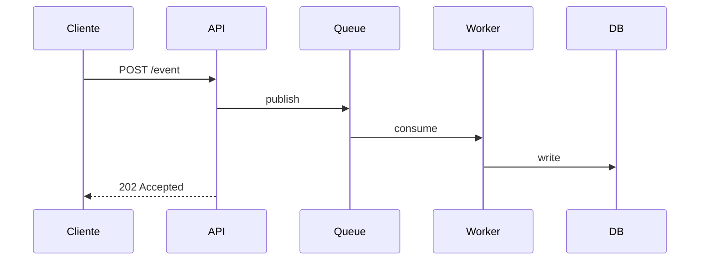

# {{TITLE}}

{{SUBTITLE}}

<div class="pt-12 opacity-70 text-sm">
  <mdi-arrow-right class="inline" /> Espaço para avançar
</div>

<!--
Notas do apresentador — contexto, gancho inicial, quanto tempo ficar neste slide.
-->

---
layout: quote
transition: fade
---

# "A melhor arquitetura é aquela que pode ser refeita."

<QuoteReveal
  text="A melhor arquitetura é aquela que pode ser refeita."
  author="Martin Fowler"
  :auto-play="true"
/>

---
layout: fact
transition: zoom
title: Por que isso importa
---

# 3.2x

<StatNumber :value="3.2" suffix="x" label="mais rápido com a nova arquitetura" :decimals="1" />

<CalloutBadge variant="live" text="medido em prod" class="mt-8" />

---
title: Antes e depois — refactoring story
---

# Refactoring story

````md magic-move
```ts
// V1 — imperative loop
function process(data) {
  const result = []
  for (let i = 0; i < data.length; i++) {
    result.push(transform(data[i]))
  }
  return result
}
```

```ts
// V2 — map functional
function process(data) {
  return data.map(item => transform(item))
}
```

```ts
// V3 — curried + nome melhor
const transformAll = data => data.map(transform)
```
````

---
title: Arquitetura do pipeline
---

# Arquitetura



---
title: KPIs
---

# Métricas que importam

<MetricGrid :cols="3" :items="[
  { value: '99.9', suffix: '%', label: 'uptime' },
  { value: '3.2', suffix: 'x', label: 'throughput' },
  { value: '12', suffix: 'min', label: 'p99 latency' },
  { value: '420', prefix: '+', label: 'deploys/dia' },
  { value: '67', suffix: '%', label: 'cost reduction' },
  { value: '0', label: 'incidentes Sev1' }
]" />

---
layout: two-cols
title: Comparação antes/depois
---

# Stack antigo

<v-clicks>

- Deploy manual via SSH
- Build no servidor (20min)
- Sem rollback
- 1 ambiente: prod

</v-clicks>

::right::

# Stack atual

<v-clicks>

- GitHub Actions
- Build paralelizado (2min)
- Rollback via git revert
- 3 ambientes: dev/staging/prod

</v-clicks>

---
title: Pergunta pra audiência
---

# Qual stack você usa hoje?

<InteractivePoll
  question="Sua stack atual de backend"
  :options="[
    { id: 'node', label: 'Node.js' },
    { id: 'python', label: 'Python (Flask/Django/FastAPI)' },
    { id: 'go', label: 'Go' },
    { id: 'other', label: 'Outro' }
  ]"
/>

---
title: ROI da migração
---

# ROI calculator

<ROICalculator
  :inputs="[
    { id: 'devs', label: 'Devs no time', min: 1, max: 50, default: 8 },
    { id: 'hours', label: 'Horas/sem perdidas em deploys', min: 0, max: 40, default: 12 },
    { id: 'rate', label: 'Custo hora dev', min: 50, max: 500, default: 200, prefix: 'R$ ' }
  ]"
  :formula="(v) => v.devs * v.hours * v.rate * 4"
  resultLabel="Custo mensal evitado"
  resultPrefix="R$ "
  :result-decimals="0"
/>

---
title: Roadmap
---

# Próximos passos

<Timeline orientation="horizontal" :items="[
  { date: 'Mai', title: 'MVP em prod', body: 'pipeline básico ativo' },
  { date: 'Jun', title: 'Observability', body: 'Grafana + Sentry' },
  { date: 'Jul', title: 'Multi-region', body: 'failover ativo-ativo' },
  { date: 'Ago', title: 'Auto-scaling', body: 'baseado em load' }
]" />

<div class="mt-6 text-sm opacity-60"><mdi-information-outline class="inline" /> Roadmap sujeito a ajuste conforme prioridades do trimestre.</div>

---
layout: statement
transition: zoom
---

# Construir o futuro <br> exige refazer o presente.

---
layout: end
---

# Obrigado

<div class="opacity-70 mt-8">
  <mdi-at /> @yourhandle · yoursite.com
</div>

<RenderWhen context="presenter">
<div class="mt-4 text-sm opacity-50">
[Nota presenter: deixar 5min de Q&A]
</div>
</RenderWhen>

<!--
Encerramento — agradecer, abrir Q&A.
-->
